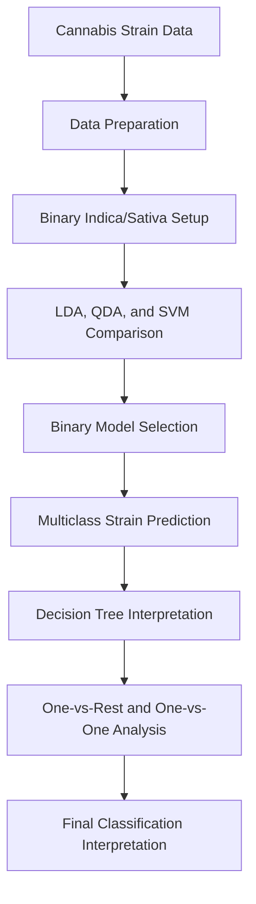
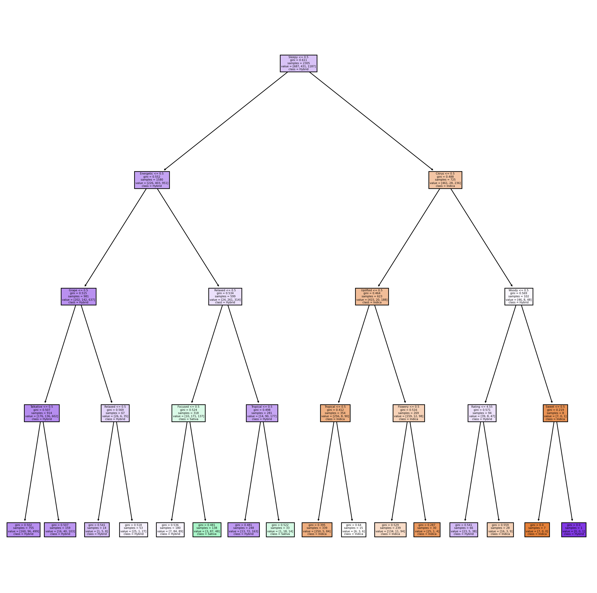

# Cannabis Strain Type Prediction


---

## Overview

This project predicts cannabis strain type using effect and flavor indicators. The main goal is to compare binary classification between Indica and Sativa with a harder multiclass classification problem that also includes Hybrid strains.

The analysis starts with binary Indica-vs-Sativa classification, then expands to Indica, Sativa, and Hybrid classification. I compare LDA, QDA, support vector classifiers, KNN, logistic regression, and a decision tree to understand which models separate the strain types most effectively.

---

## Project Workflow



---

## Business Problem

Cannabis strains are often described using effects and flavors, but those descriptions can overlap across strain types. A classification model can help test whether those indicators are strong enough to distinguish Indica, Sativa, and Hybrid strains.

This project focuses on questions such as:

- Are Indica and Sativa easier to separate than Hybrid strains?
- Which model performs best on the binary classification task?
- How much does accuracy drop when Hybrid strains are added?
- Which strain types are most often confused with each other?

---

## Dataset

The project uses the cleaned cannabis dataset:

- `cannabis_full.csv`

The original dataset was sourced from Kaggle, and the notebook uses the cleaned version for modeling.

The features are effect and flavor indicators created from the strain descriptions. These binary features represent whether a strain is associated with a specific effect or flavor.

### Target Variable

- `Type`

This is a supervised classification problem because the goal is to predict the strain type from known effect and flavor features.

---

## Exploratory and Modeling Approach

The notebook first removes Hybrid strains to create a clearer binary classification problem between Indica and Sativa. After choosing the best binary model, the analysis adds Hybrid strains back in to test the harder three-class problem.

### Methods Used

- Binary and multiclass classification
- LDA and QDA
- RBF support vector classifier
- Polynomial support vector machine
- Decision tree classification
- K-nearest neighbors classification
- Logistic regression
- One-vs-rest classification
- One-vs-one classification
- Confusion matrices
- Accuracy-based model comparison



---

## Model Performance

### Binary Indica-vs-Sativa Classification

The binary model performs best when Hybrid strains are removed:

- LDA accuracy: about `0.843`
- QDA accuracy: about `0.854`
- RBF SVC accuracy: about `0.860`
- Polynomial SVM accuracy: about `0.854`

I would choose the RBF SVC for the binary task because it has the highest accuracy at about `0.860`. This suggests that Indica and Sativa separate more clearly than Hybrid strains when using the available effect and flavor features.

### QDA Regularization

QDA improves when regularization is added:

- Best regularization value: `0.1`
- Cross-validated accuracy: about `0.854`

Regularization matters here because the effect and flavor indicators can be sparse and correlated. Without enough regularization, some covariance estimates become unstable.

### Multiclass Classification

Adding Hybrid strains makes the problem much harder:

- Multiclass LDA accuracy: about `0.629`
- Multiclass QDA accuracy: about `0.596`
- Multiclass KNN accuracy: about `0.600`

LDA performs best in the three-class comparison, but the accuracy is much lower than the binary RBF SVC result. This shows that Hybrid strains overlap with both Indica and Sativa in the feature space.

### One-vs-Rest and One-vs-One Results

The class comparison results show that Sativa is the easiest class to separate, while Hybrid is the hardest:

- Best one-vs-rest Sativa result: logistic regression at about `0.828`
- One-vs-rest Hybrid results stay near `0.62`
- Best one-vs-one pair: Indica vs Sativa, with SVC accuracy about `0.851`
- Harder one-vs-one pairs involve Hybrid strains

These results confirm that the main classification difficulty comes from Hybrid strains rather than from separating Indica and Sativa.

---

## Final Interpretation

The analysis shows that Indica and Sativa are the most distinct strain types in this dataset. The RBF SVC is the strongest binary model because it reaches the highest accuracy when comparing only those two classes.

When Hybrid strains are added, model performance drops sharply. This makes sense because Hybrid strains share characteristics with both Indica and Sativa, so the available effect and flavor features do not separate them as cleanly. For the full three-class task, LDA performs best among the tested models, but the lower accuracy shows that Hybrid prediction remains the main limitation.

---

## Technologies Used

- Python
- pandas
- NumPy
- scikit-learn
- plotnine
- Jupyter Notebook

---

## Files

```text
compare/
|-- lab8_cannabis_predictions.ipynb
|-- lab8_cannabis_predictions.html
|-- lab8_cannabis_predictions_README.md
|-- cannabis_full.csv
|-- cannabis.csv
|-- readme_assets/
    |-- lab8_cannabis_predictions_preview_1.png
```

---

## How to Run

1. Open `lab8_cannabis_predictions.ipynb` in Jupyter Notebook.
2. Make sure `cannabis_full.csv` is in the same folder as the notebook.
3. Run the notebook cells in order.

---

## Future Improvements

- Add text-based features from strain descriptions if available.
- Tune additional SVC and KNN hyperparameters.
- Test ensemble models such as random forest or gradient boosting.
- Explore whether grouping rare effects or flavors improves Hybrid classification.
